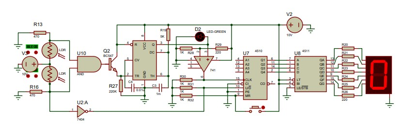
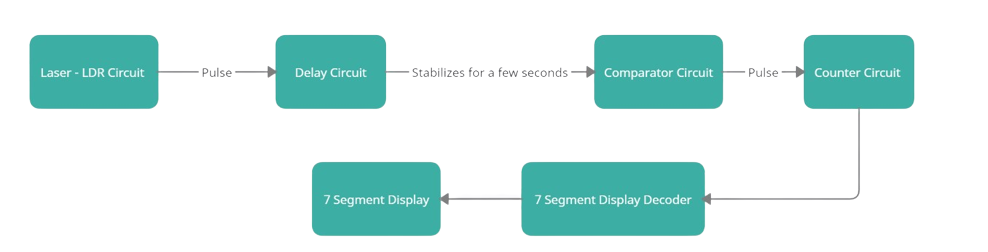
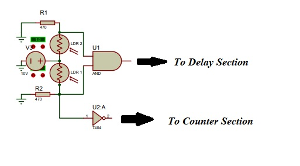
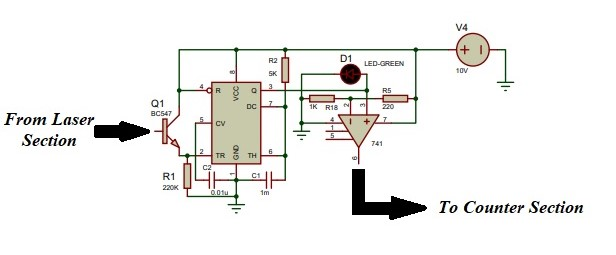
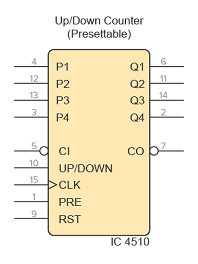
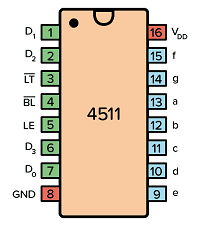
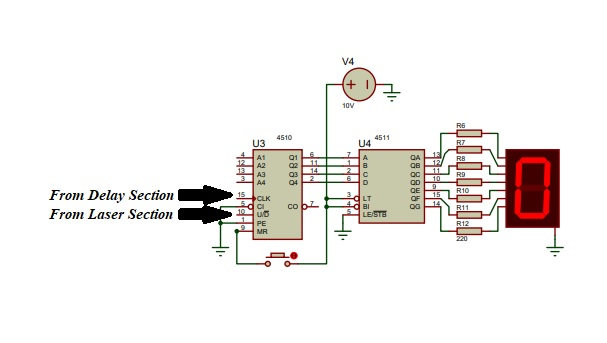
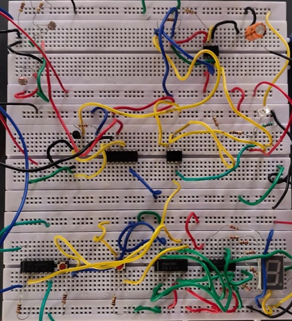

 

---

---

💫 This repository presents the design of a Bidirectional Visitor counter.

  &emsp;&emsp;🔹 It is typically a Mod 10 counter (can also be increased to any count) which keeps a count of the number of persons who have moved across the device.

  &emsp;&emsp;🔹 The device increments when a person moves inside and decrements when a person moves outside.

 

# 📑 Table of Contents 

 * [Introduction](#-Introduction)
 * [Short Description of the Circuit](#-Short-Description-of-the-Circuit)
 * [Block Diagram](#-Block-Diagram)
 * [Brief Description of the Circuit](#-Brief-Description-of-the-Circuit)
    * [Laser or Detector Section](#-Laser-or-Detector-Section) 	
    * [Delay Section](#-Delay-Section) 	
    * [Counter Section](#-Counter-Section) 	
 * [Installations for Simulation](#-Installations-for-Simulation)
 * [Schematics for Simulation](#-Schematics-for-Simulation)
 * [Hardware Implementation](#-Hardware-Implementation)
   * [Components Required](#-Components-Required)
   * [Implemented Circuit](#-Implemented-Circuit)
 * [Final Implementation](#-Final-Implementation)
 * [Applications](#-Applications)
 * [Further Improvements that can be made](#-Further-Improvements-that-can-be-made)
 * [Authors](#-Authors)
 * [Acknowledgements](#-Acknowledgements)
   
   

# 🪢 Introduction 

&emsp; 🔹The proposed project is a bidirectional visitor counter, as the name suggests the counter is designed to be placed at the entrance of a hall/room. The counter is designed to increment its count by one when a person moves inside the room and decrement its count by one when a person exits the room. Hence, it can now keep an exact count of the number of people who are currently inside the room.

<i><b>
&emsp; 🔹The implemented circuit is:</i></b>
 

 

 [Back To Top](#-Table-of-Contents) ⤴️ 

 

# 🪢 Short Description of the Circuit

 
 
&emsp; ➪ The circuit for simplicity can be seperated as three independent sections, namely

	🎯 Laser (Dectector) Section
 	🎯 Delay Section
 	🎯 Counter Section

 

&emsp;➪ The basic idea behind the project is that when a person enters a room, the count should increase by one and when he leaves the room the count should decrease by one, the laser section consists of two LDRs, depending on the LDR from which voltage pulse is received first the direction of movement of the person can be identified. The delay section is used to suppress the second voltage pulse (from another LDR) when the person crosses. The counter section is an independent part which counts both forward and backward depending on the LDR from which the voltage pulse is recieved
	

 [Back To Top](#-Table-of-Contents) ⤴️ 

 

# 🪢 Block Diagram

<i><b>&emsp;➪ The work flow can be easily understood from the following block diagram:</i></b>
 
 

 
 

 [Back To Top](#-Table-of-Contents) ⤴️ 

 

# 🪢 Brief Description of the Circuit
 

 ##  🎯 Laser or Detector Section

 

   &ensp;🔹The laser section consist of two LDRs (Light Dependent Resistance Diodes). The basic property of the diodes is to have a very negligible resistance when illuminated with a light source and show  almost an infinite resistance when light is blocked. It's resistance varies inversly with respect to the illuminated light.

   &ensp;🔹In the below specified circuit of the laser section, we have two LDRs to detect the direction in which the person . Depending on if person cuts LDR_1 first or LDR_2 first a pulse is sent to the counter part in order to increment or decrement the count by 1. At the same time when a person cuts the LDRs another pulse is sent to the Delay section of the circuit

   &ensp;🔹The circuit diagram for Laser Section:

 

 [Back To Top](#-Table-of-Contents) ⤴️ 

 
 
 ## 🎯 Delay Section
 
 

   &ensp;🔹The Delay section consist of a typical NE555 timer IC, designed to work in Monostable Multivibrator mode. 

 `In the monostable mode of the 555 timer, also known as the "one-shot mode", when we apply a logic LOW to the trigger pin of the timer by closing the switch, the output becomes logic HIGH and holds there for a specific time duration (T), which is decided by the values of the externally connected resistor and capacitor.
`

   &ensp;🔹When an pulse is received from any one LDR, correspondingly the count will either increase or decrease. But however the person will also pass through the other LDR due to which a second pulse will be generated for a single crossing and since this pulse is from the other LDR, the count will decrease or increase (opposite action to that of what happened when he cuts the first LDR), due to which the count will not change. In short if pulse is received from both LDRs are sent to the counter circuit, the count will have no change since both these pulses have a counter action.

 

   &ensp;🔹In order to avoid this, the second pulse is supressed by using a monostable multivibrator which creates a stable pulse for about two to three seconds so that the person crosses the entire laser detection section. As a result of this stablization, only one pulse is generated when a person crosses once. 

   &ensp;🔹This part also consist of an Op-Amp LM741, used as a comparator to avoid minor pulses of low voltages to be sent to the counter section. The pulse will be sent to the counter section only if the pulse is greater than the threshold voltage of the comparator.

   &ensp;🔹The circuit diagram for Delay Section:

 [Back To Top](#-Table-of-Contents) ⤴️ 

 

 ## 🎯 Counter Section

 

   &ensp;🔹The designed counter section circuit is a simple up down counter. It consists of two ICs namely IC CD4510 and IC CD4511.

	
	
➱ IC CD4510 - `an edge-triggered synchronous up/down BCD counter. It can count up or down in BCD pattern depending upon the input states`  
➱ IC CD4511 - `a BCD to 7-segment decoder driver. Its function is to convert the logic states at the outputs of a BCD, or binary coded decimal, counter like the IC CD4510 into signals which will drive a 7-segment display`

   &ensp;🔹Pinout for IC CD4510:

 

	
 <b><i>Pinout Specifications for IC CD4510:</i></b> 

| Pin Name       | Pin #      | Type   | Description | 
|:--------------:|:----------:|:------:|:-------------:|
|            |          |   |   | 
| VDD            | 16         | Power  | Supply Voltage (+3 to +15V)          |  
| GND            | 8          | Power  | Ground (0V)   | 
| Preset         | 1          | Input  | Sets the counter to whatever is on P1-P4     |  
| Carry In       | 5          | Input  | Carry in from any previous stage, otherwise set LOW    |  
| Carry Out      | 7          | Output | Goes low when the lowest or highest value is reached  |  
| Reset          | 9          | Input  | Sets output to 0000         			 |  
| Up/Down        | 10         | Input  | Set HIGH to count up (or LOW to count down)     | 
| Q1 to Q4       | 6,11,14,2  | Output | The counter value          			  |
| P1 to P4       | 4,12,13,3  | Input  |  Value for presetting the counter         	   | 

 

   &ensp;🔹Pinout for IC CD4511:

 

 

	
 <b><i>Pinout Specifications for IC CD4511:</i></b> 

| Pin Name       | Pin #      | Type   | Description | 
|:--------------:|:----------:|:------:|:-------------:|
| VDD            | 16         | Power  | Supply Voltage (+3 to +15V)          |
| GND            | 8          | Power  | Ground (0V)   |
| a-f            | 9-15       | Input  | Outputs for the 7-segment display  | 
| D0-D3          | 7,1,2,6    | Input  | 4-bit data input   | 
| LT             | 3          | Output | Lamp Test. Turns on all segments when LOW  | 
| BL             | 4          | Input  | Blanking Test. Turns off all segments when LOW | 
| LE             | 5          | Input  | Latch Enable. Stores the current state when HIGH  |

   &ensp;🔹The circuit counts either up or down depending on whether the 10th pin of IC4510 is set HIGH or LOW. If it is set HIGH, the circuit counts up, and if it is set LOW the circuit counts down.

   &ensp;🔹The circuit diagram for Counter Section:

 

 [Back To Top](#-Table-of-Contents) ⤴️ 

 

# 🪢 Installations for Simulation
	Tool Used: Proteus 8 Professional (v8.1)
📥 Proteus 8 Professional:
 
  * Install Proteus 8 Professional from the following website:
  
     🔗 https://www.labcenter.com/downloads/
   
  *  You can also refer to the Proteus Tutorial.
  
     🔗 https://www.labcenter.com/downloads/Tutorials.pdf

 [Back To Top](#-Table-of-Contents) ⤴️ 

 

# 🖥 Schematics for Simulation

The Bidirectional Visitor Counter without using Microcontroller was implemented in Proteus, and the screenshot of the same is attached here:
`The schematic of the same is also uploaded.`

	
https://user-images.githubusercontent.com/115358075/219913300-53b6a811-973a-47cf-9acc-de387fd7f2a8.mp4
	

 [Back To Top](#-Table-of-Contents) ⤴️ 

 

# 🪢 Hardware Implementation
 

## 📋 Components Required

After creating the schematics, the same can be implemented in a bread board or PCB using the following components:

| Components                  | Specification   | Quantity  | 
|:---------------------------:|:---------------:|:---------:| 
| 7 Segment Display           | Common Cathode  | 1         | 
| Binary Up/Down Counter      | CD4510 		| 1         |  
| 7 Segment Decoder           | CD4511  	| 1         |
| 555 Timer                   | NE555      	| 1         | 
| Transistor                  | BC547      	| 1         | 
| Op-Amp          	      | LM741      	| 1         | 
| AND Gate	              | 7408      	| 1         | 
| NOT Gate	              | 7404      	| 1         | 
| LDR Diodes                  | -      		| 2         | 
| Lasers for LDR illumination | -      		| 2         |
| LED			                    | -      		| 1         | 
| Push Button	                | -      		| 1         | 
| Resistors	                  | 220    		| 8         | 
|                             | 470    		| 2         | 
|                             | 1k     		| 4         | 
|                             | 5k     		| 1         | 
|                             | 220k   		| 1         | 
| Capacitors                  | 0.01uF 		| 1         | 
|                             | 1mF    		| 1         |
| Battery                     | 9V/12V 		| 2         |

 

 [Back To Top](#-Table-of-Contents) ⤴️ 

 

## 🪢 Implemented Circuit
🔶 The Actual bread board Implementation of the circuit is:

 

 [Back To Top](#-Table-of-Contents) ⤴️ 

 

# 🪢 Final Implementation

`The final implemented circuit in hardware:`
	
https://user-images.githubusercontent.com/115358075/219919357-d0e94403-4054-4d58-b704-0ad9deb01dbd.mp4

 

 [Back To Top](#-Table-of-Contents) ⤴️ 

 
 
# 🪢 Applications

 ✔️   It can be used to determine the number of people insde a room or hall without entering into it. 
 ✔️   It can be used to check overcrowding inside a specific room. 
 ✔️   It can be used to check if not more than a few people enter in places such as ATM simultaneously. 
  
  

 [Back To Top](#-Table-of-Contents) ⤴️ 

 
 
# 🪢 Further Improvements that can be made

  🏁 The accuracy of the counter can be increased by increasing the number of LDRs.
 
  🏁 Image processing techniques can also be used for the dection section.
 
 [Back To Top](#-Table-of-Contents) ⤴️ 

 
   
 # 📜 Authors
 
  ✒️ Rubankumar D , Student, B.E ECE, Madras Institute of Technology, Anna University, Chennai, Tamil Nadu, India.   
  ✒️ Pattu Hariharaan N , Student, B.E ECE, Madras Institute of Technology, Anna University, Chennai, Tamil Nadu, India.   
  ✒️ Surendrakumar S , Student, B.E ECE, Madras Institute of Technology, Anna University, Chennai, Tamil Nadu, India.  
   
  
 # 🎓 Acknowledgements
 📖 Dr. G. Sumithra, Assistant Professor, Madras Institute of Technology, Anna University, Chennai, Tamil Nadu, India.  
 📖 [Nalinkumar S](https://github.com/Nalinkumar2002), Student, B.E. ECE, Madras Institute of Technology, Anna University, Chennai, Tamil Nadu, India.
 

---
